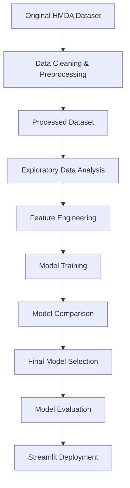

#  Mortgage Approval Prediction Using Machine Learning

## Overview

This project presents a complete end-to-end Data Science solution for predicting mortgage approval decisions using the 2023 HMDA (Home Mortgage Disclosure Act) dataset.

The original HMDA dataset was very large, making it impractical for direct storage and sharing through GitHub. Therefore, a preprocessing pipeline was developed to clean the data, retain only the relevant features, remove unnecessary records, and create a representative processed dataset suitable for model development and version control.

The project covers every stage of the machine learning lifecycle, including:

- Data cleaning and preprocessing
- Creation of a processed dataset from the original HMDA data
- Exploratory Data Analysis (EDA)
- Feature engineering
- Model training and comparison
- Performance evaluation
- Fairness analysis
- Model deployment using Streamlit

The final solution is based on a Random Forest classifier that achieved excellent predictive performance while maintaining strong generalization on unseen data.

##  Project Workflow

