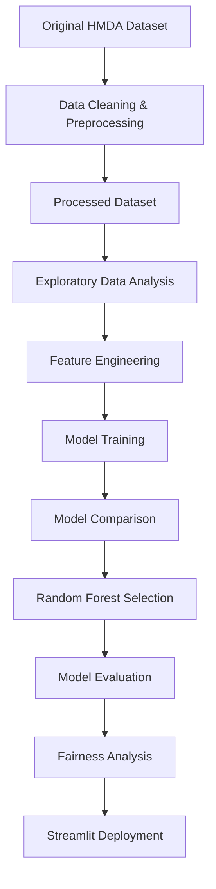

# NOVA Mortgage Intelligence

### End-to-End Machine Learning System for Mortgage Approval Prediction

[](https://mortgage-dashboard-sama.streamlit.app/)
[]
[]
[]

---

# Live Application

**Launch NOVA Mortgage Intelligence**

https://mortgage-dashboard-sama.streamlit.app/
---
---
## User Guide

A comprehensive user guide describing the complete workflow of the NOVA platform—including application navigation, mortgage prediction, model performance interpretation, data insights, verified outcome feedback, PDF report generation, and troubleshooting—is available below.

 **[Open the NOVA User Guide](USER_GUIDE.md)**
 ---

#  System Overview

Mortgage lending is one of the most significant financial decision-making processes in the banking industry. Accurately evaluating mortgage applications requires analyzing multiple financial and demographic characteristics while balancing lending risk and responsible credit allocation.

This project presents an end-to-end Machine Learning solution for predicting mortgage approval outcomes using the **2023 Home Mortgage Disclosure Act (HMDA)** dataset.

The complete workflow covers every stage of a modern Data Science project, including:

- Data preprocessing
- Exploratory Data Analysis (EDA)
- Feature Engineering
- Machine Learning model development
- Model evaluation
- Fairness analysis
- Interactive Streamlit deployment

To enable efficient model training and public repository management, the original HMDA dataset was cleaned, filtered, and transformed into a representative processed dataset containing only the most relevant variables for mortgage approval prediction.

---

#  Project Objectives

The main objectives of this project are:

- Develop a reliable Machine Learning model for mortgage approval prediction.
- Identify the financial factors that most influence lending decisions.
- Compare multiple classification algorithms.
- Evaluate predictive performance using standard Machine Learning metrics.
- Deploy the final model as an interactive web application.
- Demonstrate a complete end-to-end Data Science workflow.
- Provide an explainable and user-friendly decision-support platform for mortgage analysis.

---

#  Project Workflow



---

#  Dataset

**Dataset Source**

- Home Mortgage Disclosure Act (HMDA) – 2023

**Processed Dataset**

`hmda_2023_processed.csv`

**Dataset Size**

- Approximately **50,000** mortgage applications

**Target Variable**

| Value | Meaning |
|-------|---------|
| 1 | Approved |
| 0 | Denied |

The processed dataset included in this repository was generated from the original HMDA dataset after cleaning, filtering irrelevant records, handling missing values, and selecting the most informative predictive features.

---

#  Machine Learning Models

The following supervised learning algorithms were evaluated:

| Model | Purpose |
|--------|---------|
| Logistic Regression | Baseline Classifier |
| Random Forest | Final Production Model |

Following comparative evaluation, the **Random Forest Classifier** achieved the best predictive performance and was selected as the final deployment model.

---

#  Model Evaluation

Model performance was assessed using multiple evaluation metrics:

- Accuracy
- Precision
- Recall
- F1-Score
- ROC-AUC
- Precision-Recall Curve
- Confusion Matrix

The Random Forest model demonstrated the strongest balance between predictive accuracy, robustness, and generalization capability.

---

#  Feature Importance

Feature importance analysis identified the following variables as the strongest predictors of mortgage approval:

- Annual Income
- Loan Amount
- Debt-to-Income Ratio (DTI)
- Loan-to-Value Ratio (LTV)
- Interest Rate
- Property Value

These variables contributed most significantly to the model's predictive decisions.

---

#  Fairness Analysis

Beyond traditional performance evaluation, the project includes a fairness assessment examining prediction outcomes across demographic groups.

This additional analysis helps evaluate model behavior and supports more transparent and responsible Machine Learning practices.

---

#  Streamlit Application

The final Random Forest model was deployed as an interactive Streamlit web application.

The application enables users to:

- Enter mortgage applicant information
- Predict mortgage approval probability
- Analyze financial health indicators
- View detailed mortgage analytics
- Explore interactive Data Insights dashboards
- Review model performance metrics
- Submit verified outcomes through the Model Feedback system
- Generate a professional PDF report

🔗 **Live Application**

https://mortgage-dashboard-sama.streamlit.app/

---

#  Technologies

- Python
- Pandas
- NumPy
- Scikit-Learn
- Matplotlib
- Seaborn
- Plotly
- Joblib
- Streamlit
- ReportLab
- Google Colab
- Git
- GitHub

---

#  Repository Structure

```
Mortgage_Approval_Prediction.ipynb
hmda_2023_processed.csv
mortgage_pipeline.pkl
model_columns.pkl

app.py
pages/
utils/
components/

README.md
USER_GUIDE.md
requirements.txt
LICENSE
.gitignore
```

---

#  Future Improvements

Potential future extensions include:

- Explainable AI (SHAP)
- XGBoost and LightGBM comparison
- Hyperparameter optimization
- Bias mitigation techniques
- Cloud deployment using Docker
- Continuous model monitoring
- Continuous retraining using verified user feedback

---

#  Academic Contribution

This project demonstrates the complete lifecycle of a modern Data Science solution—from raw data preprocessing and predictive modeling to deployment within an interactive web application.

It integrates statistical analysis, supervised machine learning, model evaluation, fairness assessment, and deployment into a unified decision-support system designed for mortgage approval prediction.

The project further demonstrates the integration of software engineering principles with modern Machine Learning deployment practices

---

# Project Features

- Interactive Streamlit Dashboard
- Mortgage Approval Prediction
- Approval and Decline Probability Estimation
- Financial Health Score
- Mortgage Affordability Analysis
- Mortgage Scenario Simulator
- AI Mortgage Advisor
- Model Performance Dashboard
- Data Insights Dashboard
- Verified Outcome Feedback
- Controlled Retraining Workflow
- Professional PDF Reporting
- About NOVA Project Overview
  
#  Author

**Sama Andrea**

**B.Sc. Information Systems**

**Data Science Specialization**

**Final Capstone Project**
