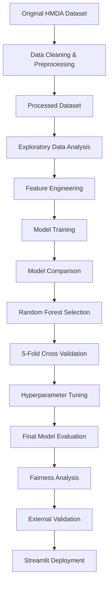

# NOVA Mortgage Intelligence

### End-to-End Machine Learning System for Mortgage Approval Prediction


[]
[]
[]

---

# Live Application

**Launch NOVA Mortgage Intelligence**

## [https://mortgage-dashboard-sama.streamlit.app/](https://mortgage-dashboard-sama.streamlit.app/)

---

## User Guide

A comprehensive user guide describing the complete workflow of the NOVA platform—including application navigation, mortgage prediction, model performance interpretation, data insights, verified outcome feedback, PDF report generation, and troubleshooting—is available below.

## **[Open the NOVA User Guide](USER_GUIDE.md)**

---

# System Overview

Mortgage lending is one of the most significant financial decision-making processes in the banking industry. Accurately evaluating mortgage applications requires analyzing multiple financial and demographic characteristics while balancing lending risk, predictive accuracy, transparency, and responsible credit allocation.

This project presents **NOVA Mortgage Intelligence**, an end-to-end Machine Learning solution for predicting mortgage approval outcomes using the **2023 Home Mortgage Disclosure Act (HMDA)** dataset.

The complete workflow covers every stage of a modern Data Science project, including:

- Data preprocessing
- Exploratory Data Analysis (EDA)
- Feature Engineering
- Machine Learning model development
- Model comparison
- Model evaluation
- 5-Fold Cross Validation
- Hyperparameter Tuning
- Feature Importance analysis
- Fairness analysis
- External Validation
- Interactive Streamlit deployment
- Professional PDF report generation

To enable efficient model training, deployment, and public repository management, the original HMDA dataset was cleaned, filtered, and transformed into a representative processed dataset containing only the most relevant variables for mortgage approval prediction.

---

# Project Objectives

The main objectives of this project are:

- Develop a reliable Machine Learning model for mortgage approval prediction.
- Identify the financial factors that most influence lending decisions.
- Compare multiple classification algorithms.
- Evaluate predictive performance using standard Machine Learning metrics.
- Assess model stability using Cross Validation.
- Improve model performance through Hyperparameter Tuning.
- Examine model behavior across demographic groups.
- Validate model generalization using external HMDA data.
- Deploy the final model as an interactive web application.
- Demonstrate a complete end-to-end Data Science workflow.
- Provide an explainable and user-friendly decision-support platform for mortgage analysis.

---

# Project Workflow



---

# Dataset

**Dataset Source**

- Home Mortgage Disclosure Act (HMDA) – 2023

**Processed Dataset**

`hmda_2023_processed.csv`

**Dataset Size**

- Approximately **50,000** mortgage applications

**Target Variable**

| Value | Meaning  |
| ----- | -------- |
| 1     | Approved |
| 0     | Denied   |

The processed dataset included in this repository was generated from the original HMDA dataset after cleaning, filtering irrelevant records, handling missing values, and selecting the most informative predictive features.

Missing numerical values were handled using **Median Imputation**, while missing categorical values were represented using an **"Unknown"** category as part of the preprocessing pipeline.

---

# Machine Learning Models

The following supervised learning algorithms were evaluated:

| Model               | Purpose                |
| ------------------- | ---------------------- |
| Logistic Regression | Baseline Classifier    |
| Random Forest       | Final Production Model |

Following comparative evaluation, the **Random Forest Classifier** achieved the strongest overall predictive performance and was selected for further validation, optimization, and final deployment.

---

# Model Evaluation

Model performance was assessed using multiple evaluation metrics:

- Accuracy
- Precision
- Recall
- F1-Score
- ROC-AUC
- Precision-Recall Curve
- Confusion Matrix

The final Random Forest model achieved:

| Metric | Score |
| ------ | ----: |
| Accuracy | **0.9678** |
| Precision | **0.9830** |
| Recall | **0.9713** |
| F1-Score | **0.9771** |
| ROC-AUC | **0.9930** |
| Average Precision | **0.9967** |

These results demonstrate strong predictive performance and a high ability to distinguish between approved and denied mortgage applications.

---

# Cross Validation

To evaluate model stability and reduce dependence on a single Train/Test split, **5-Fold Cross Validation** was performed on the Random Forest model.

The Cross Validation results were:

| Fold | Accuracy |
| ---- | -------: |
| Fold 1 | 0.9695 |
| Fold 2 | 0.9722 |
| Fold 3 | 0.9699 |
| Fold 4 | 0.9715 |
| Fold 5 | 0.9699 |

**Mean Accuracy:** **0.9706 (97.06%)**

**Standard Deviation:** **0.0011**

The consistently high performance across all five folds, together with the low standard deviation, indicates that the model demonstrates strong stability and generalization capability across different data partitions.

---

# Hyperparameter Tuning

Following the initial model comparison, **Random Forest** was selected as the most promising model for further development.

A Hyperparameter Tuning process was performed using **GridSearchCV** to evaluate multiple combinations of Random Forest parameters, including:

- `n_estimators`: 50, 100, 200
- `max_depth`: 10, 20, None

The tuning process was designed to identify a configuration that maintained strong predictive performance while improving model robustness and generalization.

Following Hyperparameter Tuning and model validation, the tuned Random Forest model was selected as the final predictive model integrated into NOVA.

---

# Feature Importance

Feature Importance analysis identified the following variables as important predictors of mortgage approval:

- Annual Income
- Loan Amount
- Debt-to-Income Ratio (DTI)
- Loan-to-Value Ratio (LTV)
- Interest Rate
- Property Value

These variables contributed significantly to the model's predictive decisions and provide additional insight into the financial characteristics associated with mortgage approval outcomes.

---

# Explainability

NOVA was designed not only to generate predictions but also to provide users with greater transparency regarding the factors associated with model decisions.

The current system incorporates model-level explanatory information through **Feature Importance**, financial indicators, and interactive Data Insights.

This improves the interpretability of the prediction process and supports more transparent use of Machine Learning within the mortgage decision-support workflow.

---

# Fairness Analysis

Beyond traditional performance evaluation, the project includes a fairness assessment examining prediction outcomes across demographic groups.

This additional analysis helps evaluate model behavior and supports more transparent and responsible Machine Learning practices.

The fairness analysis is intended as an analytical assessment of model behavior and does not imply causal relationships between demographic characteristics and mortgage decisions.

---

# External Validation

In addition to internal model evaluation, the project includes **External Validation using HMDA 2022 data**.

The purpose of this stage was to evaluate the model on data originating from a different reporting year and examine its ability to generalize beyond the original 2023 development dataset.

External Validation provides an additional layer of confidence in the robustness and generalization capability of the final model.

---

# Streamlit Application

The final Random Forest model was deployed as an interactive Streamlit web application through the **NOVA Mortgage Intelligence** platform.

The application enables users to:

- Enter mortgage applicant information
- Validate input values before prediction
- Predict mortgage approval probability
- View approval and decline probability estimates
- Analyze financial health indicators
- View detailed mortgage analytics
- Explore interactive Data Insights dashboards
- Review model performance metrics
- Explore explanatory model information
- Submit verified outcomes through the Model Feedback system
- Generate a professional PDF report

**Live Application**

[https://mortgage-dashboard-sama.streamlit.app/](https://mortgage-dashboard-sama.streamlit.app/)

---

# Input Validation

NOVA includes an Input Validation mechanism designed to detect invalid or unrealistic financial values before they are submitted to the predictive model.

This validation layer improves system reliability by preventing inappropriate input from generating misleading predictions and provides users with feedback when submitted values are outside reasonable ranges.

Input Validation protects the prediction workflow but does not automatically modify or retrain the Machine Learning model.

---

# Model Feedback

NOVA includes a **Verified Outcome Feedback** mechanism that allows verified real-world outcomes to be recorded and compared with previous model predictions.

This mechanism provides a foundation for future model monitoring and controlled retraining.

Automatic continuous retraining is considered a future extension, allowing retraining to be performed only after sufficient verified observations have been collected and the updated model has been properly evaluated.

---

# Technologies

- Python
- Pandas
- NumPy
- Scikit-Learn
- Matplotlib
- Seaborn
- Plotly
- Joblib
- Streamlit
- ReportLab
- Google Colab
- Git
- GitHub

---

# Repository Structure

```text
Mortgage_Approval_Prediction.ipynb
hmda_2023_processed.csv
mortgage_pipeline.pkl
model_columns.pkl

app.py
pages/
utils/
components/

README.md
USER_GUIDE.md
requirements.txt
LICENSE
.gitignore
```

---

# Future Improvements

Potential future extensions include:

- Advanced Explainable AI using SHAP
- XGBoost and LightGBM model comparison
- Extended Hyperparameter Optimization
- Advanced bias detection and mitigation techniques
- Continuous model monitoring
- Data and concept drift detection
- Controlled model retraining using verified user feedback
- Model versioning and automated validation before deployment
- Cloud deployment using Docker
- Integration with secure financial information systems

---

# Academic Contribution

This project demonstrates the complete lifecycle of a modern Data Science solution—from raw data preprocessing and predictive modeling to model validation, optimization, and deployment within an interactive web application.

It integrates statistical analysis, supervised Machine Learning, model evaluation, 5-Fold Cross Validation, Hyperparameter Tuning, Feature Importance, fairness assessment, External Validation, and deployment into a unified decision-support system designed for mortgage approval prediction.

The project further demonstrates the integration of Data Science and software engineering principles with modern Machine Learning deployment practices.

NOVA illustrates how a Machine Learning model can be transformed from an experimental analytical model into an operational, interpretable, and user-friendly decision-support platform.

---

# Project Features

- Interactive Streamlit Dashboard
- Mortgage Approval Prediction
- Approval and Decline Probability Estimation
- Input Validation
- Financial Health Score
- Mortgage Affordability Analysis
- Mortgage Scenario Simulator
- AI Mortgage Advisor
- Model Performance Dashboard
- Data Insights Dashboard
- Feature Importance Analysis
- Fairness Analysis
- 5-Fold Cross Validation
- Hyperparameter Tuning
- External Validation
- Verified Outcome Feedback
- Professional PDF Reporting
- About NOVA Project Overview

---

# Important Notice

NOVA is an academic decision-support project developed for educational and research purposes.

Predictions generated by the system should not be interpreted as financial advice or as a replacement for professional lending decisions.

Real-world mortgage approval requires additional regulatory, legal, financial, and risk-assessment considerations beyond the scope of this academic project.

---

# Author

**Sama Andrea**

**B.Sc. Information Systems**

**Data Science Specialization**

**Final Capstone Project**

---

# NOVA Mortgage Intelligence

### From Data to Decisions You Can Trust
