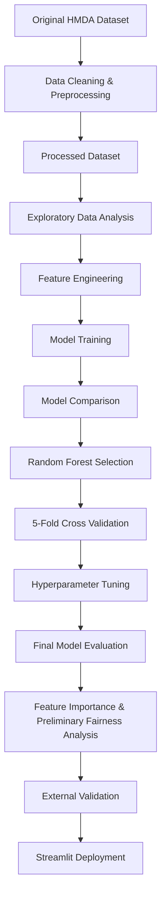

# NOVA Mortgage Intelligence

### End-to-End Machine Learning Decision-Support System for Mortgage Approval Prediction

---

# Live Application

**Launch NOVA Mortgage Intelligence**

## [https://mortgage-dashboard-sama.streamlit.app/](https://mortgage-dashboard-sama.streamlit.app/)

---

## User Guide

A comprehensive user guide describing the complete workflow of the NOVA platform—including application navigation, mortgage prediction, model performance interpretation, data insights, verified outcome feedback, PDF report generation, and troubleshooting—is available below.

## **[Open the NOVA User Guide](USER_GUIDE.md)**

---

# System Overview

Mortgage lending is a complex financial decision-making process that involves evaluating multiple financial and applicant characteristics.

This project presents **NOVA Mortgage Intelligence**, an end-to-end Machine Learning decision-support system developed to predict mortgage approval outcomes using the **2023 Home Mortgage Disclosure Act (HMDA)** dataset.

The complete workflow covers the main stages of a modern Data Science project, including:

- Data preprocessing
- Exploratory Data Analysis (EDA)
- Feature Engineering
- Machine Learning model development
- Model comparison
- Model evaluation
- 5-Fold Cross Validation
- Hyperparameter Tuning
- Feature Importance analysis
- Preliminary Fairness Analysis
- External Validation
- Interactive Streamlit deployment
- Professional PDF report generation

To enable efficient model training, deployment, and public repository management, the original HMDA dataset was cleaned, filtered, and transformed into a representative processed dataset containing the variables selected for mortgage approval prediction.

> **NOVA does not approve or reject mortgage applications and does not replace the decision-making process of a financial institution.**
>
> It provides model-based predictions derived from patterns learned from historical HMDA data and is intended as an academic decision-support and analytical system.

---

# Project Objectives

The main objectives of this project are:

- Develop a reliable Machine Learning model for mortgage approval prediction.
- Identify the variables that contribute most strongly to the model's predictions.
- Compare multiple classification algorithms.
- Evaluate predictive performance using standard Machine Learning metrics.
- Assess model stability using Cross Validation.
- Improve model performance through Hyperparameter Tuning.
- Examine potential differences in model outcomes across demographic groups.
- Evaluate model performance on external HMDA data from a different reporting year.
- Deploy the final model as an interactive web application.
- Demonstrate a complete end-to-end Data Science workflow.
- Provide an interpretable and user-friendly decision-support platform for mortgage analysis.

---

# Project Workflow



---

# Dataset

**Dataset Source**

- Home Mortgage Disclosure Act (HMDA) – 2023

**Processed Dataset**

`hmda_2023_processed.csv`

**Dataset Size**

- Approximately **50,000** mortgage applications

**Target Variable**

| Value | Meaning |
| ----- | ------- |
| 1 | Approved |
| 0 | Denied |

The processed dataset included in this repository was generated from the original HMDA dataset after cleaning, filtering irrelevant records, handling missing values, and selecting the variables used for the predictive model.

Missing numerical values were handled using **Median Imputation**, while missing categorical values were represented using an **"Unknown"** category as part of the preprocessing pipeline.

---

# Data Understanding

Before model development, the dataset was explored to understand its structure, variable types, missing values, numerical distributions, and mortgage outcome distribution.

Typical exploratory checks included:

```python
df.head()
df.shape
df.info()
df.describe()
df.isnull().sum()
df["action_taken"].value_counts()
```

These checks helped answer questions such as:

- How many observations and variables are available?
- What types of variables are present?
- Which variables contain missing values?
- How are numerical variables distributed?
- How are the mortgage outcomes distributed?
- Is there an imbalance between Approved and Denied applications?

This stage provided the foundation for the preprocessing decisions used later in the project.

---

# Target Definition

The original HMDA dataset contains several possible mortgage-application outcomes.

For this project, the prediction task was defined as a **Binary Classification** problem focused on:

```text
Approved
vs.
Denied
```

The relevant mortgage outcomes were mapped into a binary target variable:

```text
1 = Approved
0 = Denied
```

The target represents the outcome that the Machine Learning models attempt to predict.

The original outcome information used to construct the target is not used as an input feature for prediction, helping prevent **Data Leakage**.

---

# Selected Model Features

The model uses a focused group of financial, loan-related, and applicant characteristics.

## Numerical Features

- `loan_amount`
- `income`
- `interest_rate`
- `loan_to_value_ratio`
- `debt_to_income_ratio`
- `property_value`
- `loan_term`

## Categorical Features

- `applicant_age`
- `derived_race`
- `derived_sex`
- `derived_ethnicity`

These variables represent characteristics of the mortgage application, financial profile, and applicant that are used by the model to generate predictions.

The project does not assume that these variables cause mortgage approval or denial. Their predictive contribution is evaluated within the trained model.

---

# Data Preparation and Preprocessing

Raw mortgage data cannot always be passed directly into a Machine Learning algorithm.

The project therefore includes a structured preprocessing workflow.

The main preprocessing operations include:

- Missing-value handling
- Numerical imputation
- Categorical missing-value handling
- Numerical transformation
- Categorical encoding
- Consistent feature preparation

---

## Numerical Variables

Missing numerical values were handled using:

```python
SimpleImputer(strategy="median")
```

Median Imputation was used because financial variables may contain skewed distributions or extreme values, and the median is generally less sensitive to extreme observations than the arithmetic mean.

Numerical variables were also transformed using:

```python
StandardScaler()
```

Scaling is particularly useful for algorithms such as Logistic Regression, where differences in feature scales may affect model training.

---

## Categorical Variables

Missing categorical values were represented using:

```text
Unknown
```

Categorical variables were transformed into a numerical representation using **One-Hot Encoding**.

Example:

```python
OneHotEncoder(handle_unknown="ignore")
```

Using:

```python
handle_unknown="ignore"
```

allows the preprocessing workflow to handle previously unseen categories without causing the prediction process to fail.

---

# Preprocessing Pipeline

Numerical and categorical features require different preprocessing operations.

The project therefore uses a structured preprocessing workflow based on:

- `Pipeline`
- `ColumnTransformer`
- `SimpleImputer`
- `StandardScaler`
- `OneHotEncoder`

Conceptually:

```text
Raw Mortgage Application
          |
          v
   Feature Selection
          |
          v
+-----------------------+
|                       |
v                       v
Numerical Features   Categorical Features
|                       |
Median Imputation    Missing → Unknown
|                       |
Scaling              One-Hot Encoding
|                       |
+-----------+-----------+
            |
            v
      Model-Ready Data
            |
            v
     Machine Learning Model
```

Using a Pipeline helps ensure that preprocessing is applied consistently during model training and when new observations are submitted through NOVA.

---

# Machine Learning Models

The following supervised learning algorithms were evaluated:

| Model | Purpose |
| ----- | ------- |
| Logistic Regression | Baseline Classifier |
| Random Forest | Final Selected Model |

---

## Logistic Regression

Logistic Regression was used as a **baseline classification model**.

Despite the word "Regression" in its name, Logistic Regression is commonly used for binary classification.

It estimates the probability that an observation belongs to a particular class.

Using a baseline model provides a reference point for evaluating whether a more complex Machine Learning algorithm provides improved predictive performance.

---

## Random Forest

Random Forest is an **Ensemble Learning** algorithm based on multiple Decision Trees.

Rather than relying on a single tree, Random Forest combines the predictions of multiple trees to generate a final classification.

This approach can capture nonlinear relationships and interactions between variables while reducing dependence on the structure of a single Decision Tree.

Following comparative evaluation, the **Random Forest Classifier** demonstrated the strongest overall predictive performance and was selected for further validation, optimization, and final deployment.

---

# Model Evaluation

Model performance was assessed using multiple evaluation metrics:

- Accuracy
- Precision
- Recall
- F1-Score
- ROC-AUC
- Precision-Recall Curve
- Average Precision
- Confusion Matrix

Using several metrics provides a more complete evaluation than relying on Accuracy alone, particularly when the target classes are not equally represented.

---

## Understanding the Evaluation Metrics

### Accuracy

Accuracy measures the proportion of all predictions that were classified correctly.

```text
Correct Predictions
-------------------
Total Predictions
```

A high Accuracy score is useful, but Accuracy alone may be misleading when one class appears much more frequently than the other.

---

### Precision

Precision answers the question:

> Of the observations predicted as a particular class, how many actually belonged to that class?

Higher Precision means fewer false positive predictions for the evaluated class.

---

### Recall

Recall answers:

> Of all observations that actually belonged to a particular class, how many did the model correctly identify?

Recall is particularly useful when successful identification of a specific class is important.

---

### F1-Score

F1-Score combines Precision and Recall into a single metric.

It is useful when both Precision and Recall are important.

---

### ROC-AUC

ROC-AUC evaluates how well the model separates the two classes across different classification thresholds.

A value closer to:

```text
1.0
```

indicates stronger class separation.

ROC-AUC should not be interpreted as the percentage of predictions that were correct.

---

# Original Random Forest Performance

The original Random Forest model achieved:

| Metric | Score |
| ------ | ----: |
| Accuracy | **0.9678** |
| Precision | **0.9830** |
| Recall | **0.9713** |
| F1-Score | **0.9771** |
| ROC-AUC | **0.9930** |
| Average Precision | **0.9967** |

These results demonstrated strong predictive performance and strong discrimination between approved and denied mortgage applications on the evaluated data.

---

# Cross Validation

To evaluate model stability and reduce dependence on a single Train/Test split, **5-Fold Cross Validation** was performed on the Random Forest pipeline using the training data.

In 5-Fold Cross Validation, the training data is divided into five subsets.

During each iteration:

- Four subsets are used for training.
- One subset is used for validation.
- The validation subset changes between iterations.

The Cross Validation results were:

| Fold | Accuracy |
| ---- | -------: |
| Fold 1 | 0.9705 |
| Fold 2 | 0.9679 |
| Fold 3 | 0.9710 |
| Fold 4 | 0.9706 |
| Fold 5 | 0.9684 |

**Mean Accuracy:** **0.9697 (96.97%)**

**Standard Deviation:** **0.0013**

The similar performance across all five folds, together with the low standard deviation, indicates relatively stable model performance across the evaluated training-data partitions and limited sensitivity to a single split.

---

# Hyperparameter Tuning

Following the initial model comparison, **Random Forest** was selected as the most promising model for further development.

Hyperparameter Tuning was performed using:

```python
RandomizedSearchCV
```

RandomizedSearchCV evaluates sampled combinations of Random Forest hyperparameters rather than exhaustively testing every possible combination.

This provides a computationally efficient way to explore multiple model configurations.

The optimization process evaluated several Random Forest hyperparameters, including:

- `n_estimators`
- `max_depth`
- `min_samples_split`
- `min_samples_leaf`
- `max_features`
- `class_weight`

The best configuration identified during the optimization process included:

```text
n_estimators = 300
max_depth = 20
min_samples_split = 10
min_samples_leaf = 1
max_features = None
class_weight = None
```

The best Cross Validation score obtained during the RandomizedSearchCV optimization process was approximately:

```text
0.9666
```

Following Hyperparameter Tuning and final evaluation, the optimized Random Forest model was selected as the final predictive model integrated into NOVA.

---

# Tuned Random Forest Performance

The optimized Random Forest achieved:

| Metric | Score |
| ------ | ----: |
| Accuracy | **0.9708** |
| Precision – Approved | **0.9854** |
| Recall – Approved | **0.9731** |
| F1-Score – Approved | **0.9792** |
| Precision – Denied | **0.9369** |
| Recall – Denied | **0.9651** |
| F1-Score – Denied | **0.9508** |
| ROC-AUC | **0.9950** |

The tuned Random Forest demonstrated the strongest overall balance of predictive performance among the evaluated models and was selected as the final model used by NOVA.

---

# Feature Importance

Feature Importance analysis was used to examine which variables had relatively high importance in the Random Forest model's predictions.

Variables highlighted in the analysis include:

- Annual Income
- Loan Amount
- Debt-to-Income Ratio (DTI)
- Loan-to-Value Ratio (LTV)
- Interest Rate
- Property Value

These variables showed relatively high importance in the model's predictions and provide additional insight into how the Random Forest uses the available information.

> **Feature Importance represents predictive contribution within the model and does not establish causality.**

A variable with high Feature Importance should therefore not be interpreted as directly causing a mortgage application to be approved or denied.

---

# Explainability and Model Insights

NOVA was designed not only to generate predictions but also to provide users with information that can help them understand the model and the financial profile being analyzed.

The current system provides model-level insights through:

- Feature Importance
- Financial indicators
- Interactive Data Insights
- Model performance metrics
- Approval and decline probabilities

These components improve the interpretability of the system while avoiding claims that the model provides a complete causal explanation for an individual lending decision.

---

# Preliminary Fairness Analysis

Beyond traditional performance evaluation, the project includes a **preliminary fairness analysis** examining potential differences in model outcomes across demographic groups.

The purpose of this analysis is to identify possible differences in model behavior and encourage responsible interpretation of predictive results.

The analysis is exploratory and should be interpreted carefully.

> **Observed differences between demographic groups do not automatically prove discrimination, and the absence of large observed differences does not prove that the model is fair.**

The analysis also does not establish causal relationships between demographic characteristics and mortgage outcomes.

A more comprehensive fairness assessment would require additional statistical analysis, contextual evaluation, and potentially dedicated fairness metrics and bias-mitigation methods.

---

# External Validation

In addition to internal model evaluation, the project includes **External Validation using HMDA 2022 data**.

The purpose of this stage was to evaluate the model on data originating from a different reporting year and examine its performance beyond the original 2023 development dataset.

This provides additional evidence about model performance when applied to data from another reporting year.

> **External Validation using HMDA 2022 does not guarantee that the model will achieve the same performance for every future year, population, or financial institution.**

It should therefore be interpreted as an additional validation step rather than proof of universal generalization.

---

# Streamlit Application

The final optimized Random Forest model was integrated into an interactive Streamlit web application through the **NOVA Mortgage Intelligence** platform.

The application enables users to:

- Enter mortgage applicant information
- Validate input values before prediction
- Generate a model-based mortgage approval prediction
- View approval and decline probability estimates
- Analyze financial health indicators
- View detailed mortgage analytics
- Explore interactive Data Insights dashboards
- Review model performance metrics
- Explore model-level explanatory information
- Submit verified outcomes through the Model Feedback system
- Generate a professional PDF report

**Live Application**

[https://mortgage-dashboard-sama.streamlit.app/](https://mortgage-dashboard-sama.streamlit.app/)

---

# NOVA Prediction Workflow

Conceptually, a new mortgage application passes through the following process:

```text
New Mortgage Application
          |
          v
     Input Validation
          |
          v
 Preprocessing Pipeline
          |
          v
 Tuned Random Forest
          |
          v
   Model Prediction
          |
     +----+----+
     |         |
     v         v
Approved    Denied
Probability Estimates
```

The user does not need to manually perform:

- Missing-value handling
- Scaling
- Encoding
- Feature transformation

The saved preprocessing and model pipeline performs the required transformations before prediction.

---

# Input Validation

NOVA includes an Input Validation mechanism designed to detect invalid or unrealistic financial values before they are submitted to the predictive model.

This validation layer improves system reliability by preventing inappropriate input from being passed directly to the model and provides users with feedback when submitted values fall outside the expected ranges.

Input Validation protects the prediction workflow but does not automatically modify or retrain the Machine Learning model.

---

# Financial Analysis

In addition to the Machine Learning prediction, NOVA provides supporting financial indicators that help users understand the mortgage profile.

These include:

- Financial Health Score
- Mortgage affordability analysis
- Estimated monthly payment
- Loan-to-Value assessment
- Debt-to-Income assessment
- Payment-to-Income indicators
- Total estimated interest
- Total estimated repayment

These indicators complement the Machine Learning prediction and should not be interpreted as official bank underwriting criteria.

---

# Mortgage Scenario Simulator

NOVA includes an interactive Mortgage Scenario Simulator.

The simulator enables users to explore how changes in selected mortgage variables may affect financial indicators.

Possible adjustments include:

- Loan amount
- Interest rate
- Loan term
- Property value
- Income

The simulator is intended for analytical exploration.

Changes in simulated financial indicators do not guarantee that a real financial institution would approve or deny a mortgage application.

---

# AI Mortgage Advisor

NOVA includes an AI Mortgage Advisor component that provides structured observations based on the mortgage profile and calculated financial indicators.

Possible observations may relate to:

- Debt burden
- Loan-to-Value position
- Estimated affordability
- Requested loan amount
- Income capacity
- Potential financial-risk indicators

The advisor is intended for educational and analytical purposes and does not provide official financial advice or lender underwriting.

---

# Data Insights

The Data Insights dashboard provides interactive exploratory analysis of the processed HMDA dataset.

Users can examine:

- Mortgage application outcomes
- Approval and denial distributions
- Financial-variable distributions
- Applicant characteristics
- Approval patterns across selected demographic categories
- Income
- Loan amount
- Interest rate
- LTV
- DTI
- Property value

The results displayed in Data Insights are descriptive.

> **Observed patterns or differences in historical data should not automatically be interpreted as causal relationships or evidence of discrimination.**

---

# Model Performance Dashboard

The Model Performance section presents the scientific evaluation of the final Machine Learning model.

It includes information such as:

- Accuracy
- Precision
- Recall
- F1-Score
- ROC-AUC
- Confusion Matrix
- Cross Validation
- Feature Importance

The dashboard is designed to provide transparency regarding the measured performance of the final model.

---

# Model Feedback

NOVA includes a **Verified Outcome Feedback** mechanism that allows verified real-world outcomes to be recorded and compared with previous model predictions.

This mechanism supports:

- Prediction monitoring
- Comparison between predicted and verified outcomes
- Collection of future evaluation data
- A foundation for future controlled retraining

> **The production model is not automatically retrained after an individual feedback submission.**

This distinction is important because new observations should be verified and evaluated before they are used to update a production model.

---

# Controlled Model Retraining

Automatic continuous retraining is not part of the current NOVA production workflow.

A safer future workflow would be:

```text
Prediction
   ↓
Verified Outcome
   ↓
Feedback Storage
   ↓
Data Quality Review
   ↓
Batch Accumulation
   ↓
Controlled Retraining
   ↓
Model Evaluation
   ↓
Comparison with Existing Model
   ↓
Controlled Deployment
```

Retraining should occur only after sufficient verified observations have been collected and the updated model has passed formal evaluation.

---

# PDF Report Generation

NOVA includes professional PDF report generation.

The report can summarize information such as:

- Model-based prediction
- Approval probability
- Decline probability
- Risk level
- Financial Health Score
- Mortgage information
- Financial indicators
- Applicant information
- Estimated monthly payment
- Affordability indicators
- Analytical observations
- Recommendations
- Responsible-use disclaimer

The PDF report is generated from the current mortgage analysis.

---

# Technologies

- Python
- Pandas
- NumPy
- Scikit-Learn
- Matplotlib
- Seaborn
- Plotly
- Joblib
- Streamlit
- ReportLab
- Google Colab
- Git
- GitHub

---

# Repository Structure

```text
Mortgage_Approval_Prediction.ipynb
hmda_2023_processed.csv
mortgage_pipeline.pkl
model_columns.pkl

app.py
pages/
utils/
components/

README.md
USER_GUIDE.md
requirements.txt
LICENSE
.gitignore
```

---

# Installation

## 1. Clone the Repository

```bash
git clone https://github.com/samaandrea10/mortgag-dashboard.git
```

---

## 2. Navigate to the Project

```bash
cd mortgag-dashboard
```

---

## 3. Create a Virtual Environment

```bash
python -m venv .venv
```

---

## 4. Activate the Virtual Environment

### Windows

```bash
.venv\Scripts\activate
```

### macOS / Linux

```bash
source .venv/bin/activate
```

---

## 5. Install Dependencies

```bash
pip install -r requirements.txt
```

---

## 6. Run NOVA

```bash
streamlit run app.py
```

---

# Project Features

- Interactive Streamlit Dashboard
- Mortgage Approval Prediction
- Approval and Decline Probability Estimation
- Input Validation
- Financial Health Score
- Mortgage Affordability Analysis
- Mortgage Scenario Simulator
- AI Mortgage Advisor
- Model Performance Dashboard
- Data Insights Dashboard
- Feature Importance Analysis
- Preliminary Fairness Analysis
- 5-Fold Cross Validation
- Hyperparameter Tuning using RandomizedSearchCV
- External Validation
- Verified Outcome Feedback
- Professional PDF Reporting
- About NOVA Project Overview

---

# Academic Contribution

This project demonstrates the lifecycle of a modern Data Science solution—from data preprocessing and predictive modeling to model validation, optimization, and deployment within an interactive web application.

It integrates:

- Data Understanding
- Data Cleaning
- Data Preprocessing
- Exploratory Data Analysis
- Feature Engineering
- Supervised Machine Learning
- Logistic Regression
- Random Forest
- Model Comparison
- 5-Fold Cross Validation
- Hyperparameter Tuning using RandomizedSearchCV
- Model Evaluation
- Feature Importance
- Preliminary Fairness Analysis
- External Validation
- Interactive Visualization
- Streamlit Deployment
- Model Monitoring
- Verified Outcome Feedback
- Automated PDF Reporting

The project also demonstrates the integration of Data Science and software engineering principles through the transition from analytical model development to an interactive deployed decision-support application.

---

# Limitations and Responsible Use

NOVA is an academic Machine Learning decision-support project developed for educational and research purposes.

Several limitations should be considered when interpreting the results:

- Predictions are based on patterns learned from historical HMDA data.
- Historical patterns may change over time.
- Economic conditions and lending practices may change.
- Predictive relationships do not establish causal relationships.
- Feature Importance does not prove that a variable causes approval or denial.
- Differences observed between demographic groups do not automatically prove discrimination.
- Preliminary fairness analysis does not establish that the model is fair or discriminatory.
- External Validation using another reporting year does not guarantee identical performance in every future population or institution.
- The available HMDA variables do not represent every factor that may be considered in real-world mortgage underwriting.
- NOVA should not be used as the sole basis for a real mortgage decision.

Real-world mortgage approval may require additional information such as:

- Credit history
- Employment verification
- Assets
- Existing liabilities
- Property appraisal
- Documentation verification
- Regulatory requirements
- Lender-specific policies

> **NOVA provides predictive and analytical support. It does not make an official lending decision.**

---

# Future Improvements

Potential future extensions include:

- Advanced Explainable AI using SHAP
- XGBoost model comparison
- LightGBM model comparison
- Extended Hyperparameter Optimization
- Advanced bias detection and mitigation techniques
- Continuous model monitoring
- Data Drift detection
- Concept Drift detection
- Controlled model retraining using verified user feedback
- Model versioning
- Automated validation before deployment
- Cloud deployment using Docker
- Integration with secure financial information systems

---

# Conclusion

**NOVA Mortgage Intelligence** demonstrates an end-to-end approach to mortgage approval prediction using Machine Learning.

The project begins with HMDA data preparation and exploratory analysis, progresses through model development, comparison, Cross Validation, Hyperparameter Tuning, and final evaluation, and concludes with the integration of the selected Tuned Random Forest model into an interactive Streamlit decision-support platform.

The project also recognizes that strong predictive performance alone is not sufficient for responsible evaluation of a Machine Learning system. Model stability, performance across classes, interpretation, preprocessing consistency, preliminary fairness analysis, External Validation, usability, and deployment are also important components of the overall solution.

NOVA therefore represents the integration of Data Science, Machine Learning, model evaluation, and application development within a unified academic decision-support platform.

---

# Important Notice

NOVA is an academic decision-support project developed for educational and research purposes.

Predictions generated by the system should not be interpreted as financial advice or as a replacement for professional lending decisions.

Real-world mortgage approval requires additional regulatory, legal, financial, and risk-assessment considerations beyond the scope of this academic project.

---

# Author

**Sama Andrea**

**B.Sc. Information Systems**

**Data Science Specialization**

**Final Capstone Project**

---

# NOVA Mortgage Intelligence

### From Data to Decisions You Can Trust
