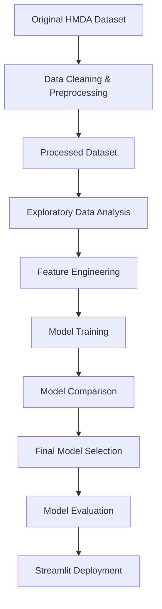

#  Mortgage Approval Prediction Using Machine Learning

A complete end-to-end Machine Learning project for predicting mortgage approval decisions using the **2023 HMDA (Home Mortgage Disclosure Act)** dataset.

---

#  Overview

This project develops a Machine Learning model that predicts whether a mortgage application will be **approved** or **denied** based on applicants' financial and demographic information.

The original HMDA dataset was very large, so a preprocessing pipeline was developed to clean the data, retain only the relevant features, and create a representative processed dataset suitable for Machine Learning and GitHub version control.

The project includes data preprocessing, exploratory data analysis (EDA), model training, evaluation, fairness analysis, and deployment using Streamlit.

---

#  Project Workflow



---

# 📂 Dataset

- **Source:** HMDA 2023 (Home Mortgage Disclosure Act)
- **Processed dataset:** `hmda_2023_processed.csv`
- **Records:** 50,000
- **Target Variable:**
  - **1** = Approved
  - **0** = Denied

The processed dataset included in this repository was generated from the original HMDA data after cleaning, filtering, and selecting the relevant features.

---

# 🤖 Machine Learning Models

The following models were evaluated:

| Model | Purpose |
|--------|---------|
| Logistic Regression | Baseline Model |
| Random Forest | Final Selected Model |

The Random Forest model achieved the best overall predictive performance and was selected for deployment.

---

# 📈 Model Evaluation

The models were evaluated using multiple performance metrics:

- Accuracy
- Precision
- Recall
- F1-score
- ROC-AUC
- Precision–Recall Curve
- Confusion Matrix

The Random Forest classifier demonstrated the best balance between predictive performance and generalization.

---

#  Feature Importance

Feature Importance analysis showed that financial variables such as **Income**, **Loan Amount**, **Debt-to-Income Ratio**, and **Loan-to-Value Ratio** had the strongest influence on mortgage approval predictions.

---

#  Fairness Analysis

A fairness analysis was conducted by comparing prediction outcomes across demographic groups, providing additional insight into the model's behavior beyond standard performance metrics.

---

#  Streamlit Application

The trained model was deployed using **Streamlit**, allowing users to enter applicant information and receive an instant mortgage approval prediction through an interactive web interface.

---

#  Technologies

- Python
- Pandas
- NumPy
- Scikit-learn
- Matplotlib
- Seaborn
- Joblib
- Streamlit
- Google Colab
- GitHub

---

#  Repository Structure

```
Mortgage_Approval_Prediction.ipynb
hmda_2023_processed.csv
requirements.txt
README.md
LICENSE
.gitignore
```

---

#  Future Improvements

- Hyperparameter optimization
- Explainable AI (SHAP)
- Additional ensemble models
- Cloud deployment

---

#  Author

**Final Data Science Project**

B.Sc. Information Systems
